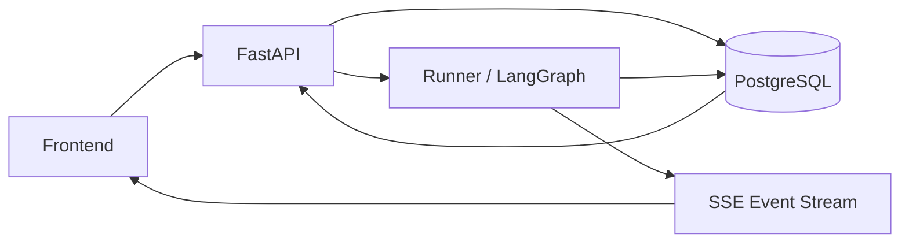

# AI Content Factory 全局优化设计方案

日期：2026-06-08

依据：[E2E_BUG_REPORT_2026-06-08.md](./E2E_BUG_REPORT_2026-06-08.md)

## 1. 设计目标

本方案不是逐个修按钮，而是把当前系统重新收敛到一条可靠的产品主链路：

```text
前端用户动作
  -> 后端 API 校验
  -> 数据库事务落库
  -> Worker 执行状态机
  -> run_events 持久化 + SSE 实时推送
  -> 前端按后端状态渲染
  -> 刷新/重启后可完整回放
```

验收目标：

- 所有真实 run 必须进入 PostgreSQL，禁止静默 fallback 到 memory。
- 前端所有可点击动作必须对应明确状态：成功、处理中、失败、不可用原因。
- 所有外部依赖错误必须结构化返回，尤其是 LLM 余额不足、Key 缺失、模型禁用、图片服务不可用。
- 前端显示的风格、Provider、Key 状态、run 状态必须来自后端可信数据。
- 刷新浏览器、重启服务后，运行记录、事件、草稿、编辑结果仍可恢复。
- 每个 P0/P1 问题都有自动化回归测试。

## 2. 当前系统性根因

### 2.1 数据源不唯一

当前后端同时使用 PostgreSQL 和 `memory_store`。一旦 DB 写失败，API 仍返回成功并把数据写到内存。这让前端以为任务真实创建成功，但 DB 没有 run、没有事件、无法重启恢复。

典型案例：

- 前端默认 `style_id=caoz`
- DB `styles` 表没有 `caoz`
- `runs.style_id` 外键写入失败
- 后端 fallback 到 memory
- 前端进入运行页，但 DB 无记录

### 2.2 运行状态机不显式

当前状态分散在前端判断、后端字段、事件流、worker 内部逻辑里。比如“中止”本应进入 `aborted`，但前端调用 `onDone()` 导航到编辑器，造成用户误解。

### 2.3 错误模型不统一

外部 API 报错，如 DeepSeek 余额不足、Flux 模型禁用、图片生成失败，会冒泡成 FastAPI 500 或页面泛化错误。系统没有把 provider、model、错误码、建议动作结构化。

### 2.4 配置和运行时状态混在一起

`config/models.yaml` 既是代码配置文件，又被设置页直接写回。点击保存会丢注释、重排顺序、产生代码 diff。API Keys 页面则是前端硬编码状态，不代表真实环境。

### 2.5 前端状态派生不严格

前端存在本地兜底逻辑：导出空后端草稿时使用当前编辑器 draft；工具栏能修改不可保存的占位草稿；Dashboard loading 时展示 0。这些都让 UI 显示和后端事实偏离。

## 3. 目标架构

### 3.1 单一可信数据源

生产/真实模式下，PostgreSQL 是 run、event、article、style、token、image 的唯一可信数据源。



设计规则：

- `memory_store` 只允许用于测试或显式 `APP_MODE=dev_memory`。
- 真实模式下 DB 写失败必须返回错误，不能 fallback。
- API 返回中如果出现 `_source=memory`，测试必须失败。
- 前端不直接依赖静态风格 id，风格列表从 `/api/styles` 获取。

### 3.2 显式 Run 状态机

建议统一 run 状态：

```text
queued
  -> drafting
  -> reviewing
  -> done

drafting/reviewing
  -> paused
  -> drafting

queued/drafting/reviewing/paused
  -> aborted

queued/drafting/reviewing
  -> failed
```

状态语义：

| 状态 | 含义 | 允许动作 |
|---|---|---|
| queued | 已创建，等待 worker | abort |
| drafting | Agent 正在生成 | pause, abort |
| paused | 人工暂停 | resume, abort |
| reviewing | Reviewer/Reviser 阶段 | pause, abort |
| done | 有最终草稿 | edit, export, complete/publish |
| aborted | 用户主动中止 | view events, retry |
| failed | 系统失败 | view error, retry |

前端渲染规则：

- `aborted/failed` 不自动进入编辑器。
- 没有真实 `draft_md/final_md` 时，编辑器主操作禁用。
- “打开编辑器”只在 `hasRealDraft=true` 或 `done=true` 时作为主按钮；否则改成“查看占位说明”或“查看事件”。

### 3.3 统一错误模型

所有 API 错误返回统一 JSON：

```json
{
  "error": {
    "code": "LLM_INSUFFICIENT_BALANCE",
    "message": "DeepSeek 余额不足",
    "detail": "Provider returned 402 Insufficient Balance",
    "provider": "deepseek",
    "model": "deepseek-v4-pro",
    "retryable": false,
    "action": "请充值或切换 Provider"
  }
}
```

错误分类：

| code | HTTP | 场景 |
|---|---:|---|
| `VALIDATION_ERROR` | 400/422 | 参数错误、style 不存在 |
| `DB_WRITE_FAILED` | 500 | 数据库不可写 |
| `LLM_KEY_MISSING` | 424 | Key 未配置 |
| `LLM_INSUFFICIENT_BALANCE` | 402/424 | 余额不足 |
| `LLM_MODEL_DISABLED` | 424 | 模型禁用 |
| `IMAGE_PROVIDER_FAILED` | 424 | 图片服务失败 |
| `SCRAPE_FAILED` | 422 | URL 抓取失败 |
| `RUN_NOT_EDITABLE` | 409 | 当前 run 无可编辑草稿 |

前端展示规则：

- 顶部错误条显示 `message`。
- 展开详情可见 provider/model/code。
- 所有按钮失败必须在页面显示，不只 `console.error`。

### 3.4 配置分层

把“代码默认配置”和“用户运行时配置”拆开。

建议：

- `config/models.yaml`：只读默认模板，保留注释，不由前端直接写。
- `runtime_settings` 表：存储用户修改后的 active provider、agent tier、预算、开关。
- `/api/settings`：返回 merged config = yaml defaults + DB overrides + env health。
- `/api/settings/health`：真实检测 key 是否存在、provider 是否可用、余额/模型是否可用。

新增表建议：

```sql
CREATE TABLE runtime_settings (
    key TEXT PRIMARY KEY,
    value JSONB NOT NULL,
    updated_at TIMESTAMPTZ NOT NULL DEFAULT now()
);
```

API Keys 页面展示来自后端：

```json
{
  "provider_health": {
    "deepseek": {
      "configured": true,
      "reachable": true,
      "balance_ok": false,
      "message": "余额不足"
    }
  }
}
```

### 3.5 文章数据模型收敛

当前前端有文章编辑器，但 DB 没有独立 articles 表，文章内容放在 `runs.draft_md/final_md`。短期可以继续使用 `runs` 字段，但必须明确规则：

- 草稿唯一可信来源：`runs.draft_md`
- 最终稿唯一可信来源：`runs.final_md`
- 导出只读后端内容，不使用前端本地 draft 兜底
- 无真实草稿时导出返回 409

中期可以增加文章版本表：

```sql
CREATE TABLE article_versions (
    id UUID PRIMARY KEY DEFAULT gen_random_uuid(),
    run_id UUID NOT NULL REFERENCES runs(id) ON DELETE CASCADE,
    version INTEGER NOT NULL,
    content_md TEXT NOT NULL,
    source TEXT NOT NULL, -- writer/editor/user
    created_at TIMESTAMPTZ NOT NULL DEFAULT now()
);
```

## 4. 分阶段实施方案

### Phase 0：止血，恢复真实 E2E 主链路

目标：先解决“真实 run 不落库”和“外部错误 500”。

任务：

1. 移除真实模式下的 memory fallback。
2. `POST /api/runs` 创建前校验 `style_id` 是否存在。
3. 前端 NewRun 风格下拉改为从 `/api/styles` 加载真实 styles。
4. 如果没有 style，提供“默认风格”种子数据或允许 `style_id=null`。
5. 后端 DB 写失败直接返回 `DB_WRITE_FAILED`。
6. 统一捕获 LLM `APIStatusError` / `RetryError`，返回结构化错误。
7. 风格分析、图片重生成 API 都走统一错误模型。
8. 中止按钮只 abort，不自动跳编辑器。

验收：

- 创建真实 run 后，`runs` 表有记录。
- `run_events` 表至少有 `graph.start`。
- `/api/runs/{id}/events` 不出现 `_source=memory`。
- style 不存在时创建 run 返回 422。
- DeepSeek 余额不足返回结构化 JSON。

### Phase 1：状态机和前端行为收敛

目标：前端只按后端事实渲染，不自造成功/草稿。

任务：

1. 定义 `RunStatus` 前后端共享枚举。
2. RunLive 按状态控制按钮：
   - drafting/reviewing：pause/resume/abort
   - aborted/failed：retry/view events
   - done：open editor/export
3. ArticleEditor 引入 `isEditable`、`hasRealDraft`：
   - false 时禁用工具栏、保存、标记完成、导出。
4. `/api/runs/{id}/export` 无内容时返回 409。
5. Dashboard loading 状态改为 skeleton，不显示假 0。
6. mock run 必须走终态，不允许长期 drafting。

验收：

- 点击中止后停留 RunLive，状态显示 aborted。
- aborted run 编辑器不可修改/不可导出。
- Dashboard 首屏 loading 不显示 0。

### Phase 2：配置与 Provider 健康检查

目标：设置页成为真实运维面板，不再硬编码。

任务：

1. 新建 `runtime_settings` 表。
2. `/api/settings` 改为读 yaml defaults + DB overrides。
3. `/api/settings` 保存只写 DB，不改 `config/models.yaml`。
4. 新增 `/api/settings/health`。
5. API Keys 页显示真实：
   - key configured
   - provider reachable
   - model available
   - balance status
6. Provider 卡片改为 radio/button，可键盘操作。
7. 保存设置后显示 toast/inline success/error。

验收：

- 点保存设置不会产生 git diff。
- DeepSeek 余额不足在设置页可见。
- Provider 切换后 NewRun/RunLive 显示一致。

### Phase 3：风格管理和内容资产闭环

目标：风格、样本、文章、图片都可追踪。

任务：

1. 新增系统默认风格种子：
   - `default`
   - 可选 `caoz`，但必须真实存在于 DB。
2. 风格新增空名称显示错误。
3. 粘贴失败显示“请手动粘贴 URL”。
4. 风格分析失败返回结构化错误。
5. 分析成功后写入 `style_samples`。
6. 图片重生成失败显示 provider 错误；成功后更新 DB 和 `image_cache`。
7. 图片 provider 配置独立于 LLM illustrator 文案增强。

验收：

- 默认风格永远存在。
- 风格分析至少写入 `styles.fingerprint` 和 `style_samples`。
- 图片替换失败不 500，前端显示原因。

### Phase 4：自动化测试体系

目标：每次提交前自动挡住回归。

测试分层：

```text
Unit
  - 状态机
  - 错误映射
  - settings merge

API
  - create run
  - events persistence
  - abort/resume
  - export
  - style analyze error
  - image regenerate error

E2E
  - new run -> DB -> SSE -> events
  - abort stays on run page
  - done run opens editor
  - settings save no yaml diff
```

建议测试文件：

- `tests/api/test_run_db_persistence.py`
- `tests/api/test_run_status_machine.py`
- `tests/api/test_error_contract.py`
- `tests/api/test_settings_runtime.py`
- `tests/api/test_style_contract.py`
- `frontend/tests/e2e/run-lifecycle.spec.ts`
- `frontend/tests/e2e/settings.spec.ts`
- `frontend/tests/e2e/editor-guards.spec.ts`

## 5. 关键接口契约

### 5.1 创建 run

请求：

```json
{
  "user_request": "写一篇 AI 日报",
  "style_id": "default",
  "target_platform": "wechat",
  "mock": false,
  "config": {}
}
```

成功：

```json
{
  "run_id": "...",
  "status": "queued"
}
```

style 不存在：

```json
{
  "error": {
    "code": "VALIDATION_ERROR",
    "message": "风格不存在",
    "detail": "style_id=caoz not found",
    "retryable": false
  }
}
```

### 5.2 Run 详情

必须包含前端决策字段：

```json
{
  "run_id": "...",
  "status": "drafting",
  "has_draft": false,
  "is_editable": false,
  "can_export": false,
  "can_abort": true,
  "can_resume": false,
  "error": null,
  "draft_md": null,
  "final_md": null
}
```

### 5.3 Settings health

```json
{
  "active_provider": "deepseek",
  "providers": {
    "deepseek": {
      "configured": true,
      "reachable": true,
      "model_available": true,
      "balance_ok": false,
      "message": "余额不足"
    }
  }
}
```

## 6. 数据迁移与清理建议

### 6.1 种子默认风格

插入真实默认风格，避免 `caoz` 这类前端静态 id 破坏外键。

```sql
INSERT INTO styles (id, name, description, fingerprint, sample_count)
VALUES
  ('default', '默认通用风格', '系统默认风格', '{}', 0)
ON CONFLICT (id) DO NOTHING;
```

是否保留 `caoz` 有两种选择：

- 保留：插入 `id='caoz'` 的 seed style，让现有前端选项合法。
- 更推荐：删除前端静态选项，完全从 `/api/styles` 动态加载。

### 6.2 清理历史 mock/drafting

建议将长期无事件的 mock drafting run 标记为 `aborted` 或 `failed`，并在 Dashboard 上标识 mock。

规则：

```text
config.mock=true AND status=drafting AND created_at < now() - interval '30 minutes'
=> status=aborted, error='stale mock run cleaned'
```

### 6.3 禁止线上 memory source

新增启动检查：

```text
APP_MODE=production 时：
- DATABASE_URL 必须可连接
- migration 必须为 head
- API 响应不得出现 _source=memory
```

## 7. 前端交互原则

1. 按钮可点必须代表动作可执行。
2. 按钮不可点必须有原因：tooltip、旁边说明或 inline alert。
3. 成功/失败必须可见，不只写 console。
4. 页面刷新后状态来自后端，不从前端猜。
5. 占位内容不可编辑、不可导出、不可标记完成。
6. 列表统计加载中不显示 0。
7. 所有 clickable div 改为 button/radio/tab 等语义组件。

## 8. 建议实施顺序

### 第 1 天：修 P0 主链路

- DB 写失败不 fallback
- 前端风格动态加载
- 默认风格 seed
- LLM 错误结构化
- 中止不跳编辑器
- 补 API 测试

### 第 2 天：修 P1 行为一致性

- Run 状态机统一
- 编辑器 guard
- 导出 guard
- Dashboard loading
- Settings 不写 yaml

### 第 3 天：修 Provider/风格/图片可观测

- Provider health
- API Keys 真实状态
- 风格分析结构化错误和 samples 落库
- 图片重生成错误结构化

### 第 4 天：E2E 自动化和数据清理

- Playwright/Codex browser 测试脚本
- stale mock cleanup
- CI 最小验证
- 回归 bug report 中所有用例

## 9. 最小可交付版本定义

完成以下事项即可认为“真实可跑”：

- 创建真实 run 必定落库。
- 运行事件必定落 `run_events`。
- 浏览器刷新后 run 和事件可回放。
- 外部 LLM 余额不足时页面明确提示。
- 中止后停留运行页。
- 有正文才能编辑/导出。
- 设置页不会改写代码配置文件。
- E2E 测试能覆盖 create -> event -> abort/done -> refresh。

## 10. 风险与取舍

### 短期不建议继续扩大功能

在 P0 未修复前，继续做图片质量、更多平台适配、更多 Agent 参数都会放大不一致问题。

### memory fallback 只能用于测试

memory fallback 对 demo 很方便，但现在已经成为真实链路的主要风险源。建议把它关进明确的 `mock/dev` 模式。

### 设置页不要直接管理 secret

API Key 建议仍通过 `.env` 或 secret manager 注入。前端只展示健康状态，不展示完整 key，不负责写入密钥。

## 11. 验收清单

- [ ] `POST /api/runs` 使用不存在 style 返回 422。
- [ ] 前端 NewRun 默认风格来自 DB。
- [ ] 创建真实 run 后 DB `runs` 有记录。
- [ ] `run_events` 有 `graph.start`。
- [ ] `/events` 不出现 `_source=memory`。
- [ ] DeepSeek 余额不足返回结构化错误。
- [ ] 中止后仍在 RunLive。
- [ ] aborted run 编辑器工具栏禁用。
- [ ] aborted run 导出禁用或返回 409。
- [ ] 设置保存不产生 `config/models.yaml` diff。
- [ ] API Keys 页 DeepSeek 状态与真实健康检查一致。
- [ ] Dashboard loading 不显示假 0。
- [ ] stale mock run 不污染最新真实运行。

